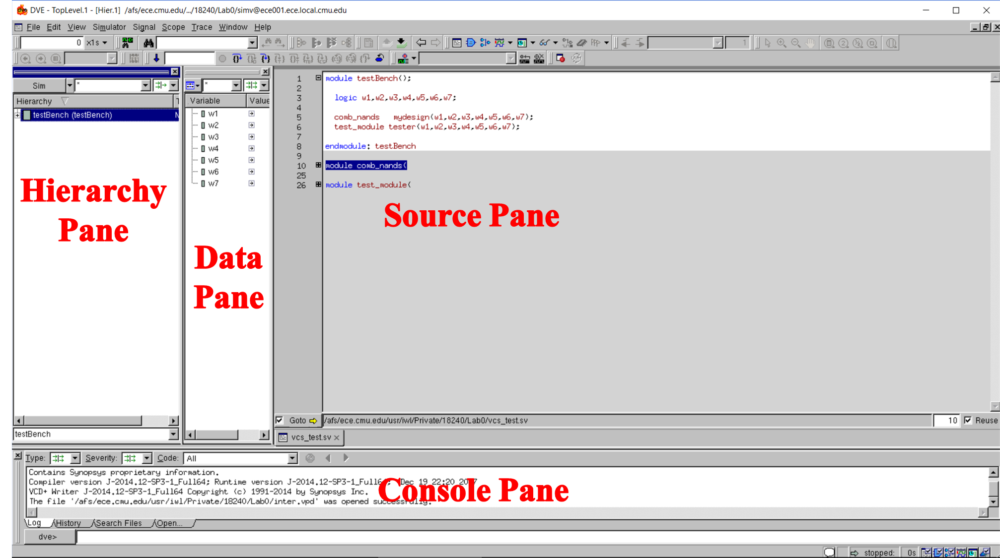
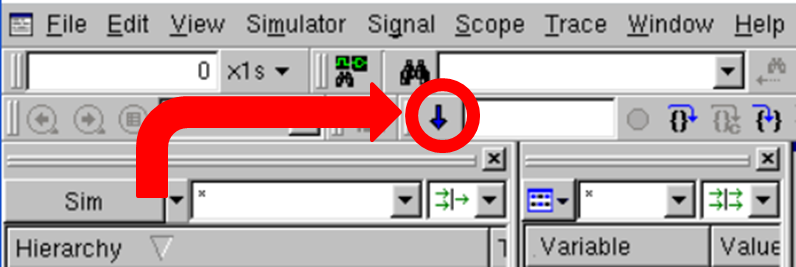

The waveform viewer is an *extremely* useful tool for debugging your design.
While you may be tempted to rely solely on `$display` statements for debugging,
it cannot be stressed enough that **you should use the waveform for debugging**.
It may not be absolutely necessary for extremely simple designs, but once you
get to more complex ones with many signals you should use the waveform.

If you find yourself stuck when debugging, and you haven't tried the waveform
viewer **you should try the waveform viewer**. Otherwise you won't get much
sympathy from the TAs.

It is worth noting that [if you are SSHing then you will need to set up X11
forwarding](Setting-up-X11-forwarding).

## Starting the waveform viewer
Compile with the debug flag
```bash
vcs -sverilog -debug <filename>.sv
```
Execute with the -gui flag
```bash
./simv -gui &
```
To compile and start the waveform viewer:
```bash
vcs -sverilog -gui -R <filename>.sv
```
This starts up a GUI interface to the simulator, known as DVE (Discovery Visual
Environment).



#### Hierarchy Pane
* Shows the different modules of your design and how they are nested within each other
* Expand by clicking the little plus sign
* Select a module by clicking on it

#### Data
* Shows the names and types of all signals defined in a selected module
* Highlight multiple signals by holding the CTRL key
* Highlight all signals with CTRL+A

#### Source Pane
* Displays SystemVerilog file
* Expand modules by clicking the little plus sign
* This is not a text editor. You can’t change your SystemVerilog file in this window

#### Console Pane
* Displays simulation output
* You can run the simulation in any of the following ways:
    * Click Simulator &rarr; Start/Continue
    * Press F5
    * Press the blue down arrow in the top left corner



## Generating the signal waveform
1. Highlight the signals in the Data Pane that you want displayed.
2. Click Signal (or right click in data pane) &rarr; Add to Waves &rarr; New
   Wave View
3. Run the simulation in any of the mentioned three ways

## Saving signals across sessions
You may find it irritating to have to close the waveform viewer, recompile your
code, and readd the signals you were looking at. Thankfully you can save the set
of signals viewed on the waveform viewer to load later.
1. On the waveform viewer window (not the DVE window with the individual panes),
   click File &rarr; Save Session.
2. This will create a `.tcl` file. Name it to something appropriate and put it
   somewhere where you can find it later.
3. The next time you open up DVE (i.e. after recompiling), simply click File
   &rarr; Load Session, and open up that `.tcl` file you saved.

## Additional notes
* To add more signals to the Wave View, highlight the desired signals and right
  click &rarr; Add to Waves &rarr; Add to Wave \#
* Zoom in and out on the waveform by holding the CTRL key and using the +/- keys
* For multibit signals, you can change the display from hex to decimal by right
  clicking the signal &rarr; Set Radix &rarr; Decimal. Note that the "Decimal"
  radix is *signed*, so if you want unsigned you should set the radix to
  "Unsigned".
* To edit SystemVerilog in the Waveform Viewer, right click in the Source Pane
  &rarr; Edit Source and a separate terminal window will open up your sv file.
